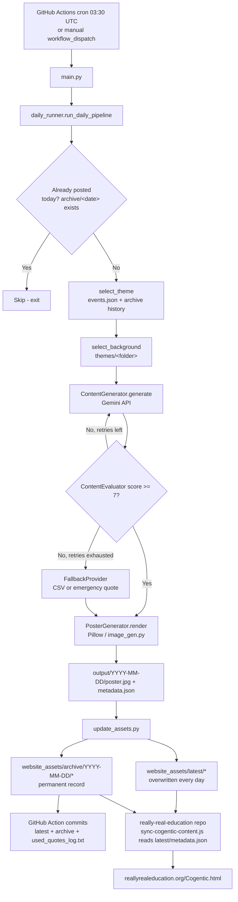

# Cogentic AI — Architecture & File Guide

This document explains how Cogentic works end-to-end and what every file in the
repository is responsible for. It is intended as an onboarding reference for
new developers — read this before making changes to the pipeline.

---

## 1. What Cogentic Does (in one paragraph)

Once a day, a GitHub Actions workflow runs `main.py`. It picks a theme (either
a calendar event from `events.json`, or a random theme that hasn't been used
recently), asks Google Gemini to write a quote + short explanation + long
explanation + hashtags for that theme, has a second Gemini call **grade** that
content for quality, retries if it scores too low, falls back to a curated CSV
of quotes if Gemini keeps failing, renders a poster image with Pillow, and
finally commits the poster + metadata into the repo (`website_assets/`) so the
[reallyrealeducation.org](https://reallyrealeducation.org) website (a
*separate* repository) can pull it in and display it.

---

## 2. High-Level Flow



**Key idea:** `website_assets/latest/` is "what today's post currently looks
like" (gets overwritten). `website_assets/archive/YYYY-MM-DD/` is the
**permanent historical record** and is also read back by the pipeline itself
on the next run, to know what themes/quotes were already used recently. The
website's image URLs and the pipeline's own memory both depend on `archive/`
being correct — never remove or bypass the archive-writing step.

---

## 3. Repository Layout

```text
Cogentic/
├── main.py                     # Entry point — just calls run_daily_pipeline()
├── config.json                 # ALL runtime configuration (themes, fonts, thresholds, paths)
├── events.json                 # Calendar of fixed-date special events → forces a theme that day
├── image_gen.py                # Low-level Pillow rendering used by rendering/poster_generator.py
├── preview_tomorrow.py         # Dev-only script: preview tomorrow's content without saving anything
├── test_alignment.py           # Manual/dev script for checking poster text alignment
├── requirements.txt            # Python dependencies
├── used_quotes_log.txt         # Flat list of every quote ever used (dedup guard), committed by CI
│
├── content/                    # "Brain" of the pipeline — talks to Gemini
│   ├── generator.py            #   ContentGenerator: builds the prompt, calls Gemini, parses JSON
│   ├── evaluator.py            #   ContentEvaluator: asks Gemini to grade the generated content
│   └── fallback.py             #   FallbackProvider: CSV-based + hardcoded emergency content
│
├── scheduler/
│   └── daily_runner.py         # Orchestrator: theme/background selection, retry loop, saves output/
│
├── rendering/
│   └── poster_generator.py     # Thin wrapper around image_gen.render_output_image()
│
├── website_assets/
│   ├── update_assets.py        # Copies output/ poster+metadata into latest/ and archive/<date>/
│   ├── latest/                 #   poster.jpg + metadata.json for "today" (overwritten daily)
│   ├── archive/                #   poster.jpg + metadata.json per date (permanent, never overwritten)
│   └── README.md                #   Frontend integration notes + metadata.json schema
│
├── publishing/
│   └── linkedin_publisher.py   # Builds a LinkedIn caption from latest/metadata.json; posts if token set
│
├── themes/                     # Background images grouped by theme, used by select_background()
│   ├── peace/  climate/  education/  health/  women/  events/
│
├── *.csv (peace_justice.csv, climate.csv, quality_education.csv,
│           reduced_inequalities.csv, quotes.csv, Event_quotes.csv)
│                                # One CSV per theme — curated fallback quotes, keyed by config.json
│
├── output/                     # Generated poster + metadata.json per run — NOT committed to git
├── logs/                       # cogentic.log — NOT committed to git
│
└── .github/workflows/
    └── daily_content.yml       # The GitHub Actions job that runs everything daily
```

---

## 4. File-by-File Reference

### `main.py`
Single-purpose entry point. Just calls
`scheduler.daily_runner.run_daily_pipeline()`. Run with:
```bash
python main.py
```

### `config.json`
Central configuration — nothing in the Python code should hardcode a path,
theme name, font size, or threshold. Key sections:
- `gemini` — model name (`gemini-2.5-flash`) and API key env var name
- `quality` — `passing_score` (7), `max_retries` (3), `retry_delay_seconds`
- `paths` — `output_dir`, `logs_dir`, `used_quotes_log`, `website_latest_dir`
- `website` — filenames used inside `website_assets/latest/`
- `linkedin` — access token env var, API base URL
- `themes` — per-theme: background `folder`, `csv_fallback` file, poster
  `layout`, and font/colour `render_overrides`
- `poster` — global font/layout defaults and supported image extensions
- `emergency_failsafe` — the absolute last-resort quote if everything else fails

### `events.json`
A `MM-DD → { event, theme, csv_row }` map of ~100 calendar dates (World
Health Day, Independence Day, Teacher's Day, etc.). If today's date is a key
in this file, `select_theme()` **forces** that theme (and the CSV fallback
path uses `csv_row` to try to find a matching quote) instead of the normal
random rotation.

### `content/generator.py` — `ContentGenerator`
- `get_recent_quotes()` — reads the last 15 entries from
  `website_assets/archive/*/metadata.json` and gives them to Gemini as "do not
  repeat these" context.
- `generate(theme, event=None)` — builds a prompt asking Gemini for
  `{quote, explanation, long_explanation, hashtags}` as JSON, applies word-count
  safety limits, and returns a dict. If `event` is provided, the prompt is
  constrained to that specific calendar occasion.

### `content/evaluator.py` — `ContentEvaluator`
Sends the generated `{quote, explanation}` to Gemini a second time with a
"strict Quality Control Editor" persona prompt and asks for a `{score,
reasoning}` JSON. `passed()` returns true when `score >= passing_score` (7 by
default, from `config.json`).

### `content/fallback.py` — `FallbackProvider`
Used only when Gemini generation/evaluation fails after all retries, or
throws an exception:
1. `get_fallback_quote(theme, event)` looks up the theme's CSV file (e.g.
   `quality_education.csv`), filters by `occasion` column if there's an active
   event, and returns the first quote not already in `used_quotes_log.txt`.
2. If the CSV is missing/exhausted, falls back further to
   `_emergency_failsafe()`, which returns the hardcoded quote from
   `config.json`'s `emergency_failsafe` section.
3. `_build_long_explanation()` synthesizes a Jalte Diye Foundation-flavoured
   long-form paragraph for both of the above paths, since CSV rows and the
   emergency quote don't have Gemini-authored long explanations of their own.
4. `is_quote_used()` / `mark_quote_used()` read/append
   `used_quotes_log.txt`, the permanent global dedup list (separate from the
   per-theme "recent quotes" memory in `generator.py`).

### `scheduler/daily_runner.py` — the orchestrator
This is the file that ties everything together. Read it top-to-bottom to
understand the whole pipeline:
- `load_events()` / `get_today_event()` — reads `events.json` for today's date.
- `select_theme()` — event takes priority; otherwise picks a random theme
  that isn't in the last 5 entries of `website_assets/archive/`.
- `select_background()` — picks a random image file from
  `themes/<theme folder>/`.
- `generate_with_evaluation()` — the retry loop: generate → check not a
  duplicate quote → evaluate → accept if score passes, otherwise retry (up to
  `max_retries`), and fall back to CSV/emergency content if retries are
  exhausted or an exception occurs.
- `run_daily_pipeline()` — the top-level function called by `main.py`:
  1. Skip early if `website_assets/archive/<today>/` already has content
     (prevents a second manual run the same day from creating a conflicting
     post — see §6, "One Post Per Day").
  2. Select theme + background.
  3. Run the generate/evaluate/fallback loop.
  4. Render the poster via `PosterGenerator`.
  5. Write `output/<date>/poster.jpg` and `output/<date>/metadata.json`.

### `rendering/poster_generator.py` — `PosterGenerator`
Thin adapter class that calls `image_gen.render_output_image()` with the
quote, explanation, background path, and theme name.

### `image_gen.py`
The actual Pillow drawing code: loads fonts, wraps text to fit the image
width, vertically centers the quote+explanation block, and draws each line
in the theme's configured color/alignment (`THEME_REGISTRY`). **Only the
short `quote` and `explanation` are ever drawn onto the image** — the
`long_explanation` is web-only text and never rendered onto the poster.

### `website_assets/update_assets.py`
Runs as a separate step after `main.py` in the GitHub Actions workflow (and
can be run standalone for local testing, reading `output/<today>/`):
- Copies `output/<date>/poster.jpg` → `website_assets/latest/poster.jpg`
  **and** → `website_assets/archive/<date>/poster.jpg`.
- Writes `metadata.json` (with `quote`, `explanation`, `long_explanation`,
  `caption`, `hashtags`, `theme`, `image`, `source`) to **both**
  `website_assets/latest/` and `website_assets/archive/<date>/`.

The archive copy is what `content/generator.py` (`get_recent_quotes`) and
`daily_runner.py` (`select_theme`, duplicate-run guard) read back on future
runs — so both the `latest/` and `archive/` writes are required, not optional.

### `publishing/linkedin_publisher.py`
Reads `website_assets/latest/metadata.json`, builds a post caption
(preferring `long_explanation` over the short `explanation` when present),
and — if `LINKEDIN_ACCESS_TOKEN` is set — is wired up to call the LinkedIn
API (the actual HTTP calls are a documented TODO/integration point, not yet
implemented).

### `themes/`
Static background images, one subfolder per theme
(`peace/`, `climate/`, `education/`, `health/`, `women/`, `events/`).
`select_background()` picks a random file from the folder matching the
selected theme.

### `*.csv` files (repo root)
One curated CSV per theme (`peace_justice.csv`, `climate.csv`,
`quality_education.csv`, `reduced_inequalities.csv`, `quotes.csv`,
`Event_quotes.csv`), each with `quote`/`caption`/`occasion` columns, used
only as a fallback when Gemini generation fails.

### `.github/workflows/daily_content.yml`
The GitHub Actions workflow:
1. Runs daily at 03:30 UTC (09:00 AM IST) or on manual `workflow_dispatch`.
2. Installs Python 3.11 + `requirements.txt`.
3. Runs `python main.py` (needs `GEMINI_API_KEY` secret).
4. Runs `python website_assets/update_assets.py`.
5. Commits `website_assets/latest`, `website_assets/archive`, and
   `used_quotes_log.txt` back to `main` (with `[skip ci]` so it doesn't
   re-trigger itself).
6. Uploads `output/` as a downloadable workflow artifact.

### `preview_tomorrow.py`
A read-only developer utility — calls Gemini for tomorrow's (or a given
`--date`'s) theme/quote/explanation/long_explanation and prints it to the
console. **Saves nothing** — no poster, no metadata, no log file, no git
changes. Useful for previewing content without affecting production state or
tripping the "one post per day" guard.

### `output/` and `logs/`
Both are working directories, not committed to git (`output/` doesn't
persist between separate GitHub Actions runs — see §6 for why the pipeline
does NOT rely on it for duplicate-run protection).

---

## 5. Data Flow: `metadata.json` Schema

Written to both `website_assets/latest/metadata.json` and
`website_assets/archive/<date>/metadata.json`:

```json
{
  "date": "2026-09-12",
  "theme": "Quality Education",
  "quote": "...",
  "explanation": "... (2 sentences, ≤35 words — the text drawn on the poster)",
  "long_explanation": "... (8-10 sentences, 150-200 words — web-only, never on the poster)",
  "caption": "quote + explanation combined, used for social captions",
  "hashtags": ["#Cogentic", "#JalteDiyeFoundation", "..."],
  "image": "latest/poster.jpg",
  "source": "Cogentic AI"
}
```

## 6. Important Design Notes for New Developers

**One post per day, enforced via `archive/`, not `output/`.**
`output/<date>/` only exists within a single GitHub Actions checkout — it is
never committed, so it can't be used to detect "did we already post today?"
across separate runs (e.g. the scheduled run plus a manual re-trigger).
`run_daily_pipeline()` therefore checks
`website_assets/archive/<date>/` (which IS committed) before doing any work.
**Do not remove this check or revert to checking only `output/`** — a past
regression that did so caused two different, conflicting posts to be
generated for the same calendar day, leaving the live website's text and
poster image mismatched.

**`website_assets/archive/` is the pipeline's memory, not just a website
asset.** Both `select_theme()` (avoid repeating the last 5 themes) and
`ContentGenerator.get_recent_quotes()` (avoid repeating the last 15 quotes)
read from `archive/*/metadata.json`. If `update_assets.py` ever stops writing
metadata.json into `archive/<date>/`, both of these anti-repetition features
silently break.

**Event days override the random theme rotation.** `events.json` is checked
first, every day, before falling back to random theme selection.

**Poster image vs. web text are different lengths on purpose.** `explanation`
(image) is short (≤35 words) for poster legibility; `long_explanation` (web)
is 150-200 words for the article-style page on reallyrealeducation.org. Never
draw `long_explanation` onto the poster image.

**`really-real-education` is a separate repository** that syncs from this
one via `scripts/sync-cogentic-content.js`, fetching
`website_assets/latest/metadata.json` over `raw.githubusercontent.com` and
building its own `data/posts.json`. Changes to the metadata schema here must
stay compatible with what that script expects (or that repo needs
corresponding updates too).
