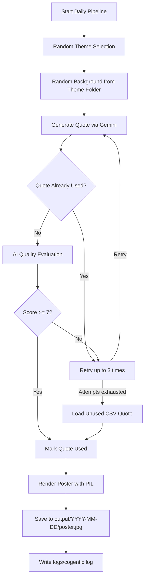

# Cogentic

**Cognitive Agentic AI System for Social Education**


---

## Vision

Cogentic is a purpose-driven artificial intelligence initiative focused on promoting ethical, educational, and socially beneficial digital content.

In an increasingly complex information ecosystem, the project aims to explore how AI systems can assist in the creation, evaluation, and delivery of content that supports learning, critical thinking, empathy, and responsible citizenship.

The long-term vision is to develop AI systems that prioritize human well-being, informed decision-making, and positive social impact alongside technological advancement.

---

## Mission

- Promote meaningful, educational, and socially constructive content
- Encourage self-awareness, empathy, and social responsibility
- Explore AI systems aligned with human-centered values
- Support healthier and more intentional content consumption
- Investigate responsible approaches to AI-assisted content curation

---

## What is Cogentic?

Cogentic is an evolving research and development project that combines:

- Generative AI for content creation
- AI-assisted content evaluation and quality assessment
- Agentic systems for decision support and content selection
- Human-centered design principles
- Responsible AI and ethical governance frameworks

The daily pipeline generates a theme-specific quote, evaluates it with an AI quality loop, falls back to curated CSV content when needed, and renders a poster image ready for publication.

---

## Architecture Diagram

```text
┌─────────────────────────────────────────────────────────────────────┐
│                         main.py / daily_runner                       │
└───────────────────────────────┬─────────────────────────────────────┘
                                │
        ┌───────────────────────┼───────────────────────┐
        ▼                       ▼                       ▼
┌───────────────┐      ┌────────────────┐      ┌──────────────────┐
│ content/      │      │ content/       │      │ content/         │
│ generator.py  │─────▶│ evaluator.py   │      │ fallback.py      │
│ (Gemini)      │      │ (Quality loop) │      │ (CSV + dedupe)   │
└───────────────┘      └────────────────┘      └──────────────────┘
                                │
                                ▼
                     ┌──────────────────────┐
                     │ rendering/           │
                     │ poster_generator.py  │
                     │ (PIL overlay)        │
                     └──────────┬───────────┘
                                ▼
                     ┌──────────────────────┐
                     │ output/YYYY-MM-DD/   │
                     │ poster.jpg           │
                     └──────────────────────┘
```

---

## Pipeline Flow



**Step-by-step:**

1. Randomly select one of four themes: Peace & Justice, Health & Mindfulness, Social Education, Climate & Environment.
2. Randomly select a background image from that theme's folder under `themes/`.
3. Generate `{ "quote": "...", "explanation": "..." }` using Gemini.
4. Evaluate content; pass if score is **7 or higher**.
5. Retry up to **3 times** if rejected or duplicate.
6. If still rejected, load an unused quote from the theme's CSV fallback file.
7. Render the final poster using existing PIL layout logic.
8. Save to `output/YYYY-MM-DD/poster.jpg` and log all steps to `logs/cogentic.log`.

---

## Folder Structure

```text
Cogentic/
├── main.py                          # Daily pipeline entry point
├── config.json                      # Runtime configuration (no hardcoded values)
├── requirements.txt                 # Python dependencies
├── used_quotes_log.txt              # Duplicate prevention log
│
├── content/
│   ├── generator.py                 # Gemini quote generation
│   ├── evaluator.py                 # AI quality evaluation
│   └── fallback.py                  # CSV fallback + used-quote tracking
│
├── rendering/
│   └── poster_generator.py          # PIL poster rendering
│
├── scheduler/
│   └── daily_runner.py              # Full daily pipeline orchestration
│
├── themes/
│   ├── peace/                       # Peace & Justice backgrounds
│   ├── health/                      # Health & Mindfulness backgrounds
│   ├── education/                   # Social Education backgrounds
│   └── climate/                     # Climate & Environment backgrounds
│
├── output/                          # Generated posters by date
├── logs/                            # Application logs
│
├── .github/workflows/
│   └── daily_content.yml            # GitHub Actions automation
│
├── test .py                         # Original prototype (preserved)
├── quotes_batch_background1.py      # Batch poster script (preserved)
├── quotes_batch_background2.py      # Batch poster script (preserved)
├── *.csv                            # Theme fallback quote datasets
└── README.md
```

---

## How To Run

### Prerequisites

- Python 3.11 or newer
- `pip` for installing Python packages
- A Gemini API key from [Google AI Studio](https://aistudio.google.com/)

### Installation

```bash
git clone https://github.com/Jalte-Diye-Foundation/Cogentic.git
cd Cogentic
python -m venv .venv
source .venv/bin/activate          # Windows: .venv\Scripts\activate
python -m pip install --upgrade pip
python -m pip install -r requirements.txt
```

### Configure Gemini API

Set your API key as an environment variable before running the pipeline:

**Linux / macOS:**

```bash
export GEMINI_API_KEY="your-api-key-here"
```

**Windows (PowerShell):**

```powershell
$env:GEMINI_API_KEY = "your-api-key-here"
```

The key is read from the environment variable named in `config.json` (`gemini.api_key_env`, default: `GEMINI_API_KEY`). Never commit API keys to the repository.

### Run the Daily Pipeline

```bash
python main.py
```

On success, output is written to:

```text
output/2026-06-22/poster.jpg
```

Logs are written to `logs/cogentic.log`.

### Run Legacy Scripts (Still Supported)

The original batch image generators remain available:

```bash
python quotes_batch_background1.py
python quotes_batch_background2.py
python "test .py"
```

---

## How To Configure

All runtime settings live in `config.json`:

| Section | Purpose |
|---------|---------|
| `gemini.model` | Gemini model name |
| `gemini.api_key_env` | Environment variable for the API key |
| `quality.passing_score` | Minimum evaluation score (default: 7) |
| `quality.max_retries` | Generation retry count (default: 3) |
| `paths.output_dir` | Poster output directory |
| `paths.log_file` | Log file path |
| `paths.used_quotes_log` | Duplicate prevention log |
| `themes` | Theme folders, CSV fallbacks, and poster layouts |
| `poster` | Fonts, layout zones, and output filename |
| `emergency_failsafe` | Hardcoded last-resort quote |

Edit `config.json` to change models, thresholds, paths, or layout without modifying Python code.

---

## How GitHub Actions Works

Workflow file: `.github/workflows/daily_content.yml`

| Trigger | Schedule |
|---------|----------|
| Automatic | Every day at **09:00 AM IST** (03:30 UTC) |
| Manual | `workflow_dispatch` from the Actions tab |

**What the workflow does:**

1. Checks out the repository
2. Sets up Python 3.11 and installs dependencies from `requirements.txt`
3. Runs `python main.py` with `GEMINI_API_KEY` from repository secrets
4. Uploads the generated poster from `output/` as a workflow artifact

**Required repository secret:**

| Secret | Description |
|--------|-------------|
| `GEMINI_API_KEY` | Your Google Gemini API key |

Add it under **Settings → Secrets and variables → Actions → New repository secret**.

---

## How New Themes Can Be Added

1. **Add a theme folder** under `themes/`, for example `themes/wellness/`, and place one or more background images (`bg1.jpg`, `bg2.png`, etc.) inside it.

2. **Add a CSV fallback file** at the repository root (or update the path in config), for example `wellness.csv`, with columns including `Quote` and `Caption`.

3. **Register the theme in `config.json`:**

```json
"Wellness & Growth": {
  "folder": "themes/wellness",
  "csv_fallback": "wellness.csv",
  "layout": "left_explanation"
}
```

4. **Choose a poster layout** from `poster.layouts` in `config.json`:
   - `left_explanation` — explanation in the bottom-left zone (from `quotes_batch_background1.py`)
   - `right_explanation` — explanation on the right side (from `quotes_batch_background2.py`)

5. Run `python main.py` to verify theme selection, generation, and rendering.

---

## Duplicate Prevention

File: `used_quotes_log.txt`

Every accepted Gemini quote and every CSV fallback quote is appended to this log. Before accepting generated content, the pipeline checks whether the quote was used previously. Duplicate Gemini outputs are rejected and retried.

---

## Logging

File: `logs/cogentic.log`

The pipeline logs:

- Theme and background selection
- Generation attempts and draft quotes
- Evaluation scores and reasoning
- CSV fallback usage
- Poster creation success or failure
- Errors with stack traces

---

## Technology Stack

- Python 3.11
- Google Gemini API (`google-genai`)
- Pillow (PIL) for poster rendering
- GitHub Actions for daily automation

---

## Core Principles

- Human-centered AI
- Transparency and accountability
- Responsible innovation
- Educational value
- Social benefit
- Continuous evaluation and improvement

---

## About Jalte Diye Foundation

Jalte Diye Foundation works toward:

- Social awareness
- Education
- Ethical development
- Community engagement
- Human values and social cohesion

Cogentic represents one effort to explore how emerging technologies can be applied in ways that contribute positively to individuals and society.

---

## Disclaimer

Cogentic is an experimental research and development initiative.

The project does not claim to determine objective ethical truth, social value, or human well-being. Any AI-assisted evaluations or recommendations should be interpreted as supportive tools operating under human oversight rather than authoritative judgments.

---

## Final Thought

> "The future of artificial intelligence should be measured not only by what it can automate, but also by how responsibly it serves humanity."
