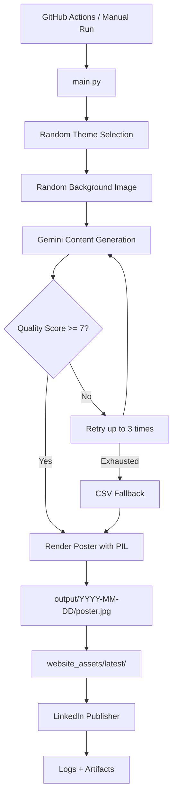

# Cogentic AI

**Cognitive Agentic AI System for Social Education**

Cogentic AI is an automated content publishing system for the [Jalte Diye Foundation](https://github.com/Jalte-Diye-Foundation). It generates fresh educational and social-impact content daily, evaluates quality with AI, renders poster images, updates website assets, and prepares LinkedIn publishing — all orchestrated through a production Python pipeline and GitHub Actions.

---

## Vision

Cogentic explores how agentic AI can create, evaluate, and deliver content that supports learning, empathy, and responsible citizenship. The long-term goal is AI systems that prioritize human well-being and positive social impact alongside technological capability.

## Mission

- Generate meaningful, educational, and socially constructive daily content
- Evaluate every post for relevance, grammar, educational value, social impact, and originality
- Deliver content to the foundation website and social channels automatically
- Maintain human-centered values, transparency, and responsible AI practices

---

## Architecture

```text
User / GitHub Actions Scheduler
        ↓
Cogentic AI Engine (main.py)
        ↓
Theme Selection
        ↓
Gemini Generation
        ↓
Quality Evaluation
        ↓
CSV Fallback (if needed)
        ↓
Poster Generator (PIL)
        ↓
Website Asset Update
        ↓
LinkedIn Publishing
        ↓
Analytics (future)
```



---

## Pipeline Flow

| Stage | Module | Description |
|-------|--------|-------------|
| 1. Theme Selection | `scheduler/daily_runner.py` | Randomly picks from six themes: Peace & Justice, Climate & Environment, Quality Education, Health & Mindfulness, Women Empowerment, Foundation Events |
| 2. Background Selection | `scheduler/daily_runner.py` | Randomly selects a background image from the theme folder under `themes/` |
| 3. Content Generation | `content/generator.py` | Gemini generates `{ quote, explanation, caption, hashtags }` as JSON |
| 4. Quality Evaluation | `content/evaluator.py` | AI scores content on relevance, grammar, educational value, social impact, and originality (minimum **7/10**) |
| 5. Retry Loop | `scheduler/daily_runner.py` | Up to **3 retries** if score is too low or quote is duplicate |
| 6. CSV Fallback | `content/fallback.py` | Loads unused quotes from theme-specific CSV files when Gemini fails |
| 7. Poster Rendering | `rendering/poster_generator.py` | Overlays quote and explanation on background using existing PIL layouts |
| 8. Output Save | `scheduler/daily_runner.py` | Saves to `output/YYYY-MM-DD/poster.jpg` and `metadata.json` |
| 9. Website Update | `website_assets/update_assets.py` | Copies poster and metadata to `website_assets/latest/` |
| 10. LinkedIn Publishing | `publishing/linkedin_publisher.py` | Prepares post from latest assets; publishes when token is configured |
| 11. Logging | `logs/cogentic.log` | Records every stage, score, fallback, and error |

---

## Technology Stack

| Technology | Role |
|------------|------|
| **Python 3.11+** | Core pipeline language and orchestration |
| **Google Gemini API** | Content generation and AI quality evaluation |
| **Pillow (PIL)** | Poster image rendering with text overlays |
| **GitHub Actions** | Daily automated execution at 09:00 AM IST |
| **LinkedIn API** | Social publishing (integration-ready) |
| **Website Integration** | Static asset delivery via `website_assets/latest/` |
| **JSON** | Configuration (`config.json`) and metadata schemas |
| **CSV** | Curated fallback quote datasets per theme |

---

## Folder Structure

```text
Cogentic/
├── main.py                          # Full pipeline entry point
├── config.json                      # All runtime configuration
├── requirements.txt
├── .env.example                     # Environment variable template
│
├── content/
│   ├── generator.py                 # Gemini content generation
│   ├── evaluator.py                 # AI quality evaluation
│   └── fallback.py                  # CSV fallback + deduplication
│
├── rendering/
│   └── poster_generator.py          # PIL poster rendering
│
├── scheduler/
│   └── daily_runner.py              # Pipeline orchestration
│
├── website_assets/
│   ├── latest/                      # Latest poster + metadata for website
│   ├── update_assets.py             # Website asset updater
│   └── README.md                    # Frontend integration guide
│
├── publishing/
│   └── linkedin_publisher.py        # LinkedIn publishing (API-ready)
│
├── themes/
│   ├── peace/                       # Peace & Justice backgrounds
│   ├── climate/                     # Climate & Environment backgrounds
│   ├── education/                   # Quality Education backgrounds
│   ├── health/                      # Health & Mindfulness backgrounds
│   ├── women/                       # Women Empowerment backgrounds
│   └── events/                      # Foundation Events backgrounds
│
├── output/                          # Generated posters by date (gitignored)
├── logs/                            # Application logs (gitignored)
│
└── .github/workflows/
    └── daily_content.yml            # Daily automation workflow
```

---

## How To Run

### Prerequisites

- Python 3.11 or newer
- A [Gemini API key](https://aistudio.google.com/)
- Optional: LinkedIn access token for publishing

### Installation

```bash
git clone https://github.com/Jalte-Diye-Foundation/Cogentic.git
cd Cogentic
python -m venv .venv
source .venv/bin/activate          # Windows: .venv\Scripts\activate
python -m pip install --upgrade pip
python -m pip install -r requirements.txt
```

### Set API Keys

Copy the environment template and fill in your keys:

```bash
cp .env.example .env
```

**Linux / macOS:**

```bash
export GEMINI_API_KEY="your-gemini-api-key"
export LINKEDIN_ACCESS_TOKEN="your-linkedin-token"   # optional
```

**Windows (PowerShell):**

```powershell
$env:GEMINI_API_KEY = "your-gemini-api-key"
$env:LINKEDIN_ACCESS_TOKEN = "your-linkedin-token"   # optional
```

Never commit `.env` or API keys to the repository.

### Run the Pipeline

**Step 1 — Generate content and poster:**

```bash
python main.py
```

**Step 2 — Update website assets:**

```bash
python website_assets/update_assets.py
```

**Step 3 — Publish to LinkedIn (optional):**

```bash
python publishing/linkedin_publisher.py
```

On success:

```text
output/2026-06-22/poster.jpg
output/2026-06-22/metadata.json
website_assets/latest/poster.jpg
website_assets/latest/metadata.json
logs/cogentic.log
```

Individual modules can also be imported programmatically from `scheduler.daily_runner`, `website_assets.update_assets`, and `publishing.linkedin_publisher`.

---

## GitHub Actions

Workflow: `.github/workflows/daily_content.yml`

| Trigger | Schedule |
|---------|----------|
| Automatic | Every day at **09:00 AM IST** (03:30 UTC cron) |
| Manual | `workflow_dispatch` from the Actions tab |

**Workflow steps:**

1. Checkout repository
2. Set up Python 3.11
3. Install dependencies from `requirements.txt`
4. Run `python main.py` with `GEMINI_API_KEY` from secrets
5. Run website asset update
6. Run LinkedIn publishing with `LINKEDIN_ACCESS_TOKEN` from secrets
7. Display pipeline logs
8. Upload `output/` and `website_assets/` as artifacts

**Required repository secrets:**

| Secret | Required | Description |
|--------|----------|-------------|
| `GEMINI_API_KEY` | Yes | Google Gemini API key |
| `LINKEDIN_ACCESS_TOKEN` | No | LinkedIn OAuth access token |

Add secrets under **Settings → Secrets and variables → Actions**.

---

## Website Integration

The website at [reallyrealeducation.org/posts.html](https://reallyrealeducation.org/posts.html) can consume the latest AI-generated post from:

```text
website_assets/latest/poster.jpg
website_assets/latest/metadata.json
```

See [website_assets/README.md](website_assets/README.md) for frontend fetch examples and the metadata schema.

**Future support:** CMS API, cloud storage (S3/GCS), CDN delivery, and database-backed post archives.

---

## LinkedIn Integration

`publishing/linkedin_publisher.py` reads the latest poster and metadata, builds a social caption, and prepares the LinkedIn API call.

When `LINKEDIN_ACCESS_TOKEN` is not set, the pipeline logs:

```text
LinkedIn publishing skipped: token not configured
```

The pipeline continues without crashing.

When a token is configured, the module is ready for the LinkedIn Images API and UGC Posts API integration.

---

## Configuration

All runtime values live in `config.json` — no hardcoded paths, themes, or thresholds in Python:

| Section | Purpose |
|---------|---------|
| `gemini` | Model name and API key environment variable |
| `quality` | Passing score (7), max retries (3), retry delay |
| `paths` | Output, logs, website asset directories |
| `website` | Metadata filename, poster filename, source label |
| `linkedin` | Access token env var and API base URL |
| `themes` | Theme folders, CSV fallbacks, poster layouts |
| `poster` | Fonts, layout zones, output quality |
| `emergency_failsafe` | Last-resort quote if all fallbacks fail |

---

## Logging

File: `logs/cogentic.log`

The pipeline logs:

- Execution start and completion
- Selected theme and background
- Gemini generation response (quote, caption, hashtags)
- Evaluation score and reasoning
- CSV fallback usage
- Poster output path
- Website asset update status
- LinkedIn publishing status
- Errors with full stack traces

---

## Future Improvements

- **Database** — persistent post history and analytics queries
- **Analytics** — engagement tracking across website and LinkedIn
- **CMS API** — push content to a headless CMS
- **Agentic workflows** — multi-agent content planning and scheduling
- **Vector database** — semantic deduplication and theme-aware retrieval

---

## About Jalte Diye Foundation

Jalte Diye Foundation works toward social awareness, education, ethical development, community engagement, and human values. Cogentic represents one effort to apply emerging AI responsibly for positive social impact.

---

## Disclaimer

Cogentic is an experimental research and development initiative. AI-assisted evaluations are supportive tools under human oversight, not authoritative judgments of ethical truth or social value.

---

## License

See [LICENSE](LICENSE) for details.
